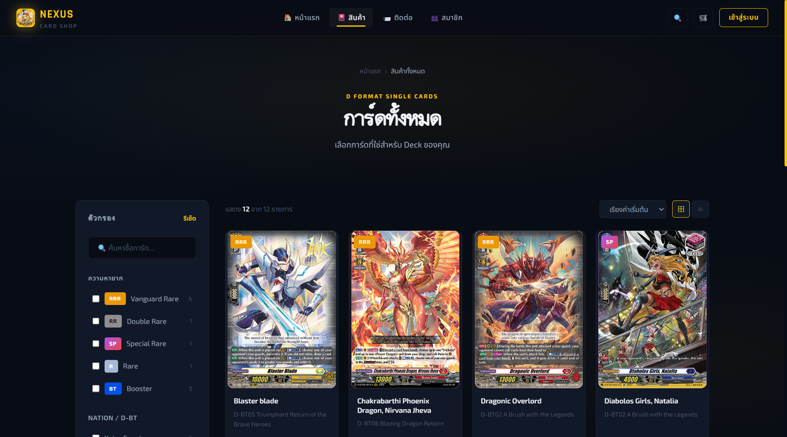
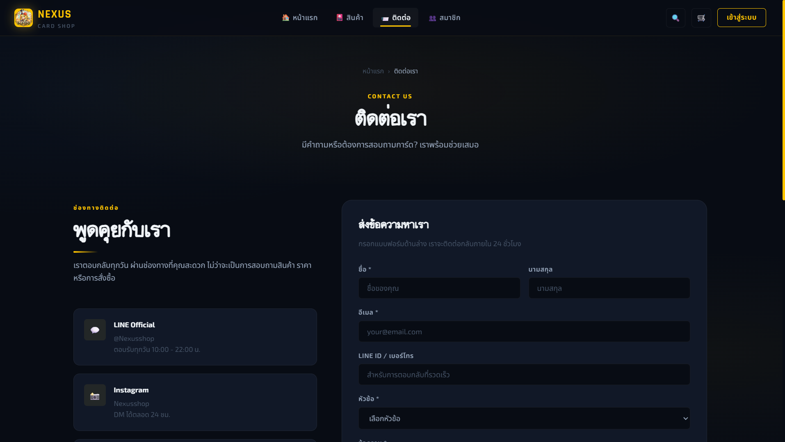

# Project 12267 
กิจกรรมภาคปฏิบัติ การทำสร้างเว็บไซต์ Responsive Design
เว็บไซต์นี้เป็นโปรเจกต์สำหรับแสดงสินค้าออนไลน์ (Static Website)
พัฒนาโดยใช้ HTML, CSS และ JavaScript และนำไป deploy บน GitHub Pages

---

##  Demo Website

🔗 https://droply2550.github.io/project12267-0.6/

---

##  Website Preview

### Home Page

### Products Page

### Contact Page

---

## 📌 Features

*  หน้า Home แสดงภาพรวมเว็บไซต์
*  หน้า Products สำหรับแสดงสินค้า
*  หน้า Contact สำหรับติดต่อ
*  UI เรียบง่าย ใช้งานง่าย
*  โหลดเร็ว (Static Website)

---

##  Technologies Used

* HTML
* CSS
* JavaScript
* GitHub Pages

---

##  Project Structure

project12267-0.6/
│── index.html
│── products.html
│── contact.html
│── css/
│── js/
│── images/

---

##  How to Run (Local)

git clone https://github.com/droply2550/project12267-0.6.git
cd project12267-0.6

เปิดไฟล์ index.html ผ่าน browser ได้เลย

---

##  Objective

* ฝึกพัฒนาเว็บไซต์พื้นฐาน
* เรียนรู้ Web หลายหน้า
* ใช้ GitHub Pages

---

##  Future Improvements

* 🛒 ระบบตะกร้า
* 🔍 ค้นหา
* 📱 Responsive
* 🔐 Backend (Django / Firebase)

---

## 👨‍💻 Author

* https://github.com/droply2550

---

## 📄 License

For educational purposes.
